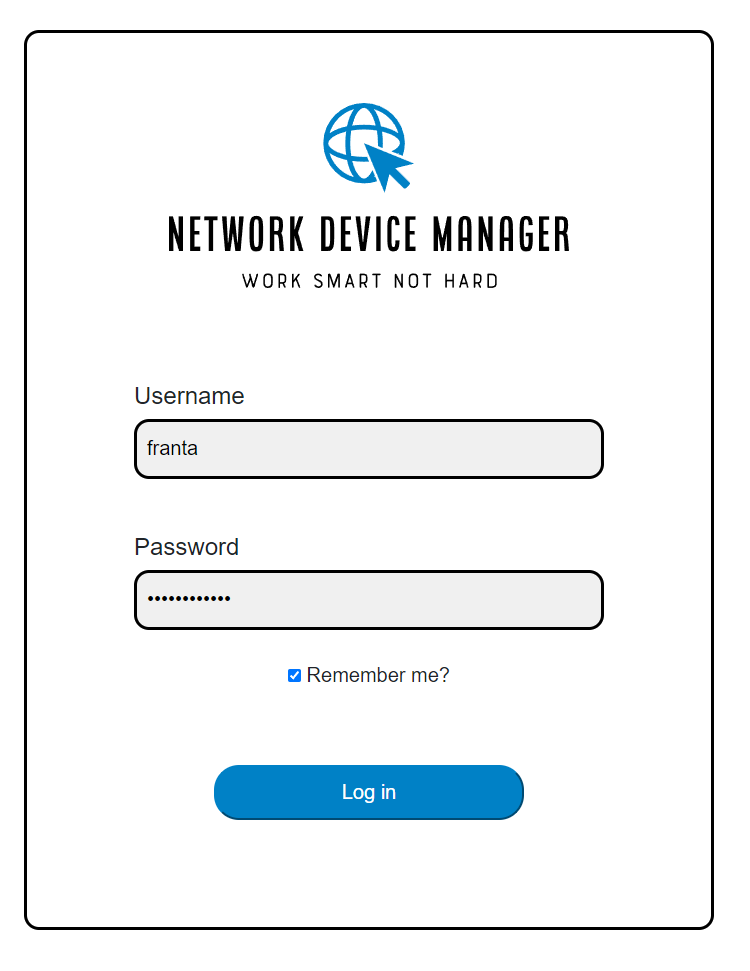
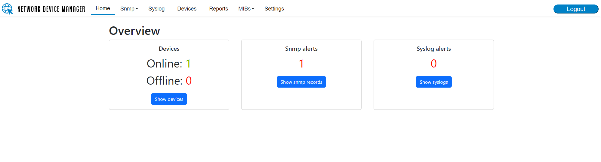
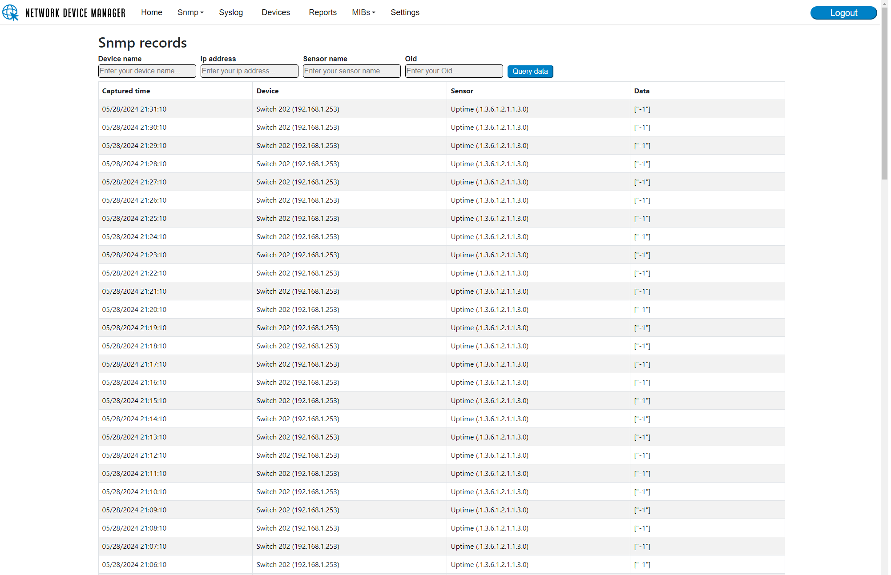
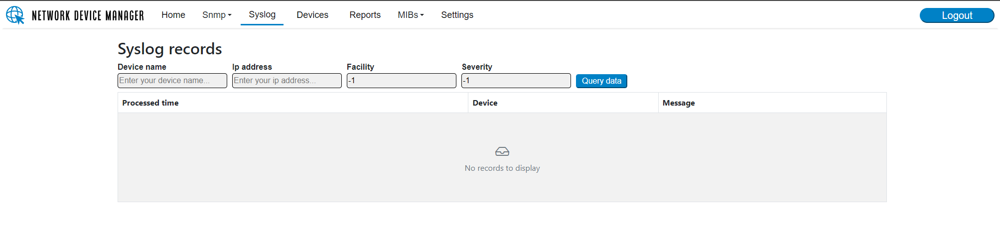
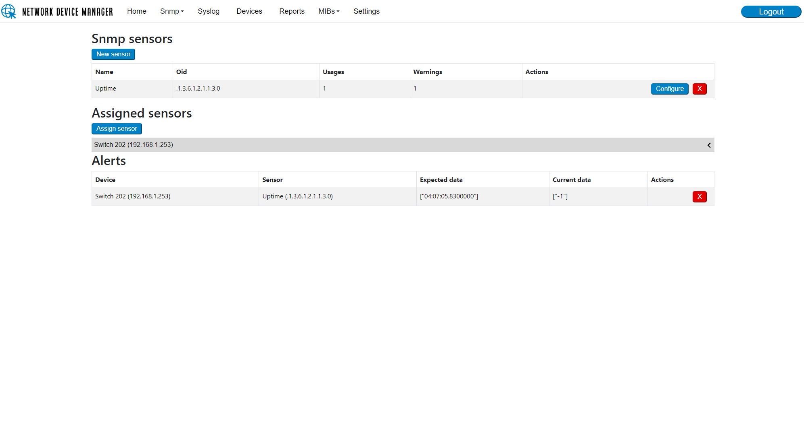
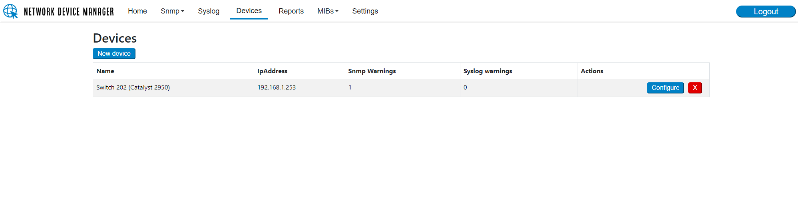
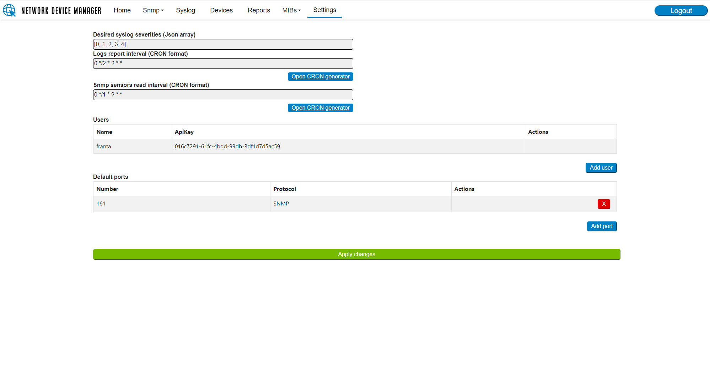
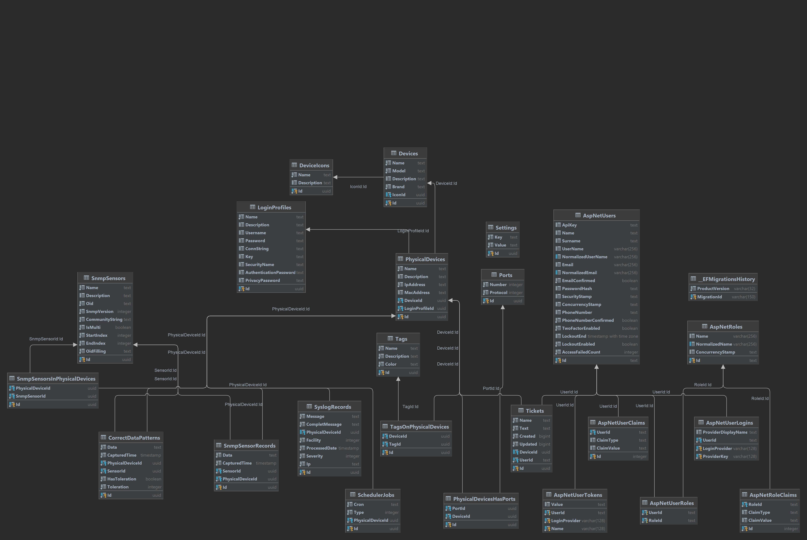

# NetDeviceManager

### Trello todo-list:
- https://trello.com/b/Lqor3Bzd/netdevicemanager

## O projektu
- Aplikace má dopomoci správcům malých sítí k jednodužšímu a rychlejšímu řešení problémů s různými typy síťových zařízení. Systém správci poskytuje data převážně za pomoci protokolu Snmp a Syslogů.
- Projekt je rozdělen na 5 mikroservis (Web, Snmp Agent, Syslog Server, Database Reporter, Api) a knihovnu pro jednodužší sdílení funkcionality mezi jednotlivými programy. 
- Programy jsou psány v jazice C# verze 8 a jako databázový engine je použit Postgres verze 16.2 . Celý systém je nasazen v dockeru za pomoci docker-compose. Pro zajištění 
správného naběhnutí celého systému je v docker-composu nastavena health-probe, která zajistí, že se ostatní kontejnery nespustí dříve než databáze. 

## Podstatné části řešení
### Webové uživatelské rozhraní
- Web je část projektu tvořená za pomoci Blazoru a Bootstrap komponent přes níž uživatel celý systém řídí. 
- Web má několik hlavních stránek
  - První stránkou je Home, kde se zobrazuje přehled toho nejduležitějšího co se v systému děje a to je počet Online/Offline zařízení, počet upozornění na nesprávné hodnoty snmp senzorů v zařízeních a počet zaznamenaných syslogů od podlédního reportu.
  - Další je Devices, která je jednou ze dvou hlavních stránek. Přidávají a kofigurují se zde profily všech zařízení, které má systém obsáhnout. 
    - Přidání zařízení je rozděleno do několika kroků. Než je možné přidat takzvané fyzické zařízení, je třeba vytvořit jakousi předlohu, 
    která reprezentuje model/typ zařízení, a nastavují se zde parametry jako například Značka nebo typ. Tento model slouží převážně pro lepší orientaci v systému,
    aby správce hned věděl o jaké zařízení se přesně jedná. 
    - Po přidání modelu zařízení přichází na řadu přidání zařízení fyzického. Pro jeho přidání je potřeba label (název pod nímž se bude v systému zobrazovat),
    Ip adresa, zvolit model zařízení a vybrat Authenikační profil, pod kterým se v případě, že je zařízení zabezpečeno, bude Snmp Agent ověřovat. Dále lze k zařízení přidat ještě specální Snmp port, popis a mac adresu opět kvůli organizaci.
  - Druhou nejdůlešitější obrazovkou je Snmp mngmt. Tato stránka slouží jednak pro přidání obecných profilů Snmp senzorů,
kvůli tomu aby je uživatel nemusel ke každému zařízení přidávat zvlášť, ale za druhé zde uživatel přiřazuje senzory k jednotlivým zařízením u nichž chce,
aby byla tato hodnota monitorována. Pro přiřezení senzoru k zařízení je nejdříve potřeba přidat zařízení a následně daný senzor.
Potom je třeba načíst ze zařízení referenčí hodnotu se ktourou se budou ty budoucí provnávat. Je možno zadat i toleranci pro případ, že bude hodnota získávaná 
  ze zařízení číselná jako například využití procesoru nebo počet zabraných mac adres na switch a bude se pohybovat v nějakém intervalu. Po přidání se senzor začne monitorovat.
Dále je na stránce tabulka, ve které se zobrazí všechny neschody mezi správnou a aktuální hodnotou senzoru.
  - Následně jsou zde obrazovky Snmp records a Syslogs ktéré pouze za pomoci tabule zobrazují poslední záznamy v databázi. Na obou stránkách jsou 
  implementovány jednoduché filtry, které filtrují záznamy podle názvů zařízení a jejich Ip adres pro zpříjemnění prohledávání záznamů.
  - Obrazovka Reports slouží uživateli ke stažení starších záznamů ve formě log souborů přiřazených jednotlivým zařízením podle Ip adresy.
  - Jako další je zde stránka Settings. Na ni lze nastavit požadované úrovně syslogů, které má systém ukládat,
a intevaly pro čtení všech snmp senzorů a tvorbu reportů a pročištění databáze. Na stránce lze také přidat a odebrat uživatele. 
V tabulce s uživately je ukázán i ApiKey, který je třeba ke komunikaci s Api například pro stažení reportu z databáze.
Druhá tabulka umožňuje spávci nastavovat defaultní porty k jednotlivým protokolům, které se použijí v případě, že k jednotlivým zařízením nejsou porty specifikovány. 
  - V navigačním baru je k dispozici ještě menu s odkazy na různé světové MIB knihovny v nichž může správce dohledat OID senzorů, které potřebuje pro dané zařízení.

### Snmp Agent
- Snmp agent je jednoduchý program, který spravuje scheduler a přidává a odebírá z něho vlákna.
Jedno vlákno odpovídá jednomu zažízení v systému. Jakmile se přidá do systému nové zařízení agent okamžitě přidá nový job,
který bude monitorovat stavy všech senzorů přiřazených k tomuto zařízení a výsledky ukládat do databáze. Intervaly jsou dány hromadně podle hodnoty v nastavané správcem a poskytuje je SettingsService.

### Syslog Server
- Syslog server je opět jednoduchá aplikace, která obsluhuje dvě vlákna. První vlákno Receiver pernamentně naslouchá UDP
komunikaci na protu 514, což je defaultní port pro posílání syslogů, a zachycené zprávy předává do sdíleného instance objektu
ServerCache. Druhé vlákno Processor kontroluje nově příchozí zprávy, filtrujeje podle požadovaných úrovní důležitosti a ukládá je do databáze.

### Database Reporter
- Tento program za pomoci scheduleru v uživatelem daných intervalech vytváří reporty k danému datu pro jednotlivá zařízení.
Poté co je vytvoří vyčistí databázi od starých záznamů. Reporty se ukládají na disk hostujícího systému a je tedy při instalaci
třeba v docker-compose.yml namapovat složku na výstupní složku reports, která je nastavena v aplikaci.

### Api
- Api slouží pro poskytování archivů s reporty z databáze, které vytváří Database Reporter. V budoucích verzích projektu
- je zamýšleno do api implementovat endpointy pro podrobné informování učivatele o aktuální sytuaci v systému, které by
- následně mohla využít mobilní aplikace, jež by opět pomohla k rychlejšímu zjištění problému některého síťového zařízení.

## Application design in Figma
- https://www.figma.com/file/lxeBbT1rmo3OwivrzSfVLN/NetDeviceManager?type=design&node-id=0%3A1&mode=design&t=o8PdbUcIOWJaL8KB-1

### Login stránka

### Hlavní přehled stavů

### Přehled záznamů z SNMP

### Přehled syslog záznamů

### Management stránka pro správu senzorů

### Přehled aktuálně přidaných zařízení

### Nastavení systému

### Schéma databáze

## Podklady pro projekt
### About SNMP
- What SNMP is: 
  - https://mwtsolutions.eu/cs/clanky/reseni-monitorovani-snmp/?utm_term=&utm_campaign=CS-DSA-articles&utm_source=adwords&utm_medium=ppc&hsa_acc=4516776325&hsa_cam=14947508358&hsa_grp=126777980365&hsa_ad=555124919512&hsa_src=g&hsa_tgt=dsa-1681546153832&hsa_kw=&hsa_mt=&hsa_net=adwords&hsa_ver=3&gad_source=1&gclid=CjwKCAjw5ImwBhBtEiwAFHDZx7K3RoqzhqKVtuwXcY8hiu0Gi-OE4JyDJslRFgWatfdYv4FpV2lKEBoClx4QAvD_BwE
  - https://cs.wikipedia.org/wiki/Simple_Network_Management_Protocol
  - https://www.samuraj-cz.com/clanek/snmp-simple-network-management-protocol/
- How SNMP works: https://www.manageengine.com/network-monitoring/what-is-snmp.html
- What SNMP traps are: https://www.netreo.com/blog/snmp-traps-definition-types-examples-best-practices/
- MIB: https://github.com/cisco/cisco-mibs/blob/main/v2/CISCO-C2900-MIB.my
- OID: https://www.dpstele.com/apps/snmp/oids.php
- Global Library with MIBs: https://www.circitor.fr/Mibs/Mibs.php
- How to make Snmp V3 operation: https://nitinmanju.medium.com/configure-network-devices-using-the-snmp-protocol-with-c-and-net-1124c5ea8827
- How to discover device: https://docs.lextudio.com/sharpsnmplib/tutorials/device-discovery

### About Syslog
- What Syslog is: 
  - https://www.crowdstrike.com/guides/syslog-logging/
  - https://stackify.com/syslog-101/
  - https://graylog.org/post/what-is-syslog-and-how-does-it-work/

### Cisco Catalyst 2950 Settings
- Factory reset: https://itskillbuilding.com/cisco/device-management/reset-cisco-switch-factory-defaults/
- Basic config: 
  - https://static.spiceworks.com/attachments/post/0017/6296/GENERIC_CISCO_SWITCH_BEST_PRACTICES_GUIDE.pdf
  - https://www.comparitech.com/net-admin/configure-cisco-switches/#Step_3_Assign_a_Password_to_the_Switch
  - https://www.networkstraining.com/basic-cisco-switch-configuration/
- SSH config: https://gulian.uk/8-steps-to-configure-ssh-on-a-cisco-router-or-switch/
- SNMP basic and trap config: https://www.manageengine.com/products/oputils/enable-snmp-cisco-router.html
- Syslog config: https://blog.noblinkyblinky.com/2018/11/25/configuring-a-cisco-device-to-send-syslog-messages/
- Syslog server code exapmle: https://github.com/jchristn/WatsonSyslogServer/tree/master

### SNMP library for C#
- 1)
-   https://www.nuget.org/packages/SnmpSharpNet#readme-body-tab
-   https://nitinmanju.medium.com/configure-network-devices-using-the-snmp-protocol-with-c-and-net-1124c5ea8827
- 2)
-   https://docs.lextudio.com/sharpsnmplib/tutorials/v3-operations

- https://www.c-sharpcorner.com/article/snmp-trap-listener-using-snmp-library/
- https://www.codeproject.com/articles/468892/an-introduction-to-sharpsnmp-an-open-source-snmp?fid=1791335&df=90&mpp=25&sort=Position&view=Normal&spc=Relaxed&prof=True&fr=26
- https://www.nuget.org/packages/Lextm.SharpSnmpLib

### Web
- How to make design: https://thewhitelabelagency.com/best-resolution-for-web-design/
- Design in Figma: https://www.figma.com/file/lxeBbT1rmo3OwivrzSfVLN/NetDeviceManager?type=design&node-id=0%3A1&mode=design&t=o8PdbUcIOWJaL8KB-1
- Design inspiration:
  - https://www.cisco.com/c/video/webinars/en_in/enterprise-networks/dna-center-overview-demo.html
  - https://www.youtube.com/watch?v=NKw0drOyQCU

### CRON
- What is cron: 
  - https://www.hostingy.net/co-je-to-cron-a-k-cemu-se-pouziva/
  - https://en.wikipedia.org/wiki/Cron
- Scheduler but cannot input cron in cron expression: https://positiwise.medium.com/using-fluentscheduler-with-c-for-task-scheduling-4cb886abc0a3
- How to make job in FluentScheduler: https://docs.particular.net/samples/scheduling/fluentscheduler/
- Scheduler that can use cron expression to schedule job: 
  - https://www.quartz-scheduler.net/
  - https://www.nuget.org/packages/Quartz
- How to pass data to job in Quartz:
  - https://coderanch.com/t/454107/languages/Passing-parameters-Quartz-job
- How to setup trigger with cron expression in Quartz:
  - https://www.quartz-scheduler.net/documentation/quartz-3.x/tutorial/crontriggers.html#building-crontriggers

### Microservice architecture 
- How to make microservice architecture with db: 
  - https://medium.com/@akshatsharma0610/microservice-database-management-c01ba9849a88
  - https://www.baeldung.com/cs/microservices-db-design

### DI
- How to add DI to console app: 
  - https://www.c-sharpcorner.com/article/using-dependency-injection-in-net-console-apps/
  - https://learn.microsoft.com/en-us/dotnet/core/extensions/dependency-injection-usage
  - https://jasonterando.medium.com/net-core-console-applications-with-dependency-injection-234eac5a4040
- How to add DI to Quartz scheduler:
  - https://dev.to/bohdanstupak1/dependency-injection-for-quartz-net-in-net-core-3oh7

### EF
- How to add EF: 
  - https://www.tektutorialshub.com/entity-framework-core/ef-core-console-application/
  - https://medium.com/@robrich22/setup-entity-framework-core-in-console-application-code-first-ad130b53a539
- Naming conventions:
  - https://riptutorial.com/efcore-naming-conventions/learn/100002/use-naming-conventions
  - https://www.sqlshack.com/learn-sql-naming-conventions/

### Unit tests
- Testing service with EF:
  - https://learn.microsoft.com/en-us/ef/ef6/fundamentals/testing/mocking
  - https://code-maze.com/ef-core-mock-dbcontext/
  - https://www.codejourney.net/entity-framework-core-database-initialization-with-unit-test/
- Testing service that uses Snmp protocol:
  - https://stackoverflow.com/questions/19422126/unit-integration-test-ssh-connection-snmp-etc-in-c-sharp

### Syslog server
- Setup server in docker:
  - https://stackoverflow.com/questions/60061703/when-i-specify-ports-in-a-docker-compose-yml-file-is-it-tcp-or-udp
  - https://hub.docker.com/r/linuxserver/syslog-ng

### Application health check 
- https://learn.microsoft.com/en-us/aspnet/core/host-and-deploy/health-checks?view=aspnetcore-8.0

### What is api key and how it is named in production 
- https://swagger.io/docs/specification/v2_0/authentication/api-keys/

### UI use cases
  - Is device online/offline (is last record of this device maximum 20 minutes old, if not summon alarm)
    - When device was added, running job in scheduler will recognize that there is new device and it will get uptime value from it in user specified healthprobe intervals(for all devices same)

  - Alarms will be available only for oids which are marked as number by user

  - Is value of sensor different from normal (value is different from saved value, summon alarm)
    - When user attached sensor to device he press GETDATA button that will load actual data and if they are ok user will mark them as a correct state IF HE WANTS THIS FUNCTION ON FOR THIS SENSOR and system will notice him about every mismatches

  - Is value in some threshold (user will set some interval and if the value is outside, it will summon alarm)
    - The threshold will be set by user in same dialog in which he will assign a sensor to device
    - When value will be different from saved pattern than app go to watch if the value is in the threshold and if it isnt too, it will notice the user

  - At home page it will show some summary like total alerts, total online devices and so on
    - count of last responses on healthprobe get requests
    - count of alerts that will be saved in alerttable
    - count of different syslog messages with severity like error and warning
    

  - At card syslog 
    - it will highlight messages with priority like warning, error,....

## Autor: Jaroslav Němec T3 SSAKHK 2023/2024